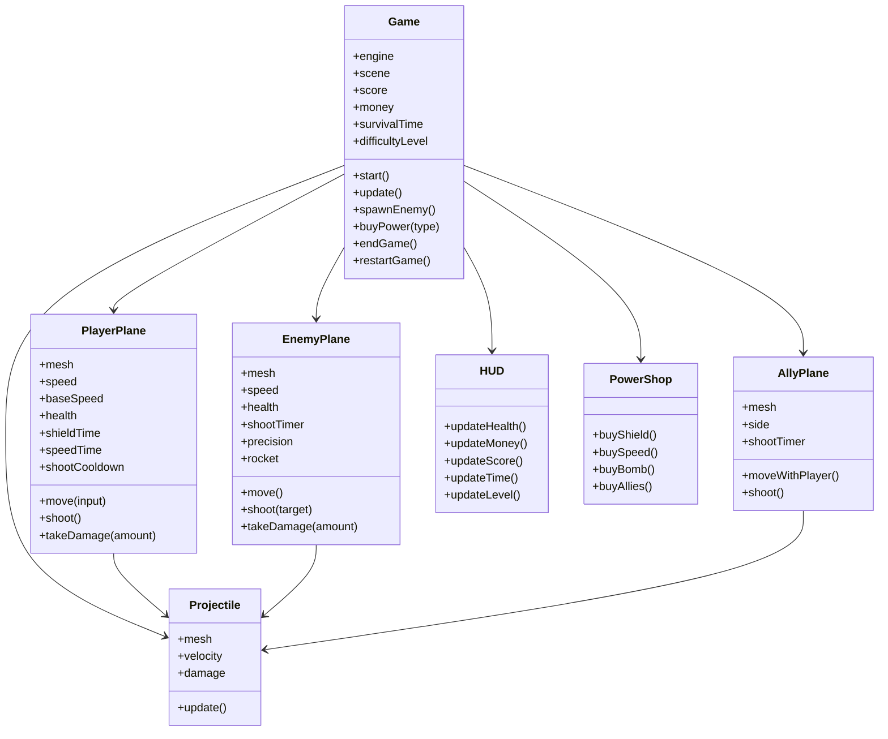
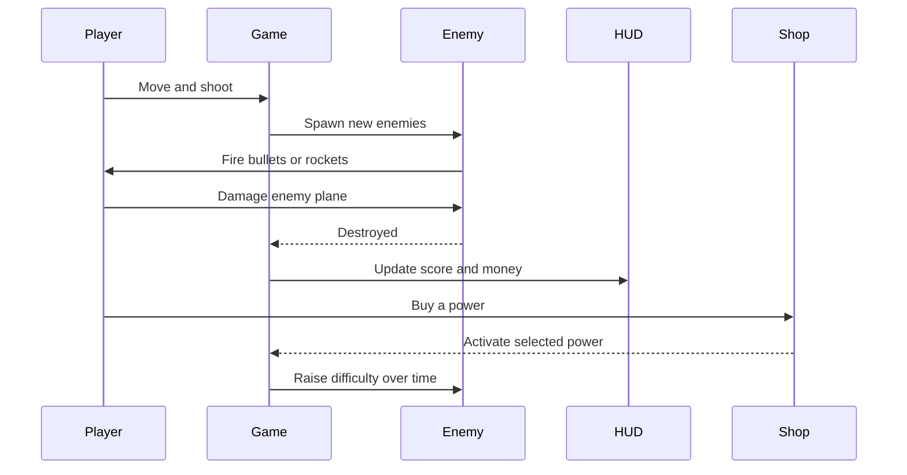

# Air Combat Game Conception

## General Direction

This game is inspired by the arcade flying style of Air Dogs of WW2.
It keeps the fast aerial combat feeling, but the progression is adapted to the school project story.

The player controls a military plane, destroys enemy planes, earns money, and buys powers during the match.
The longer the player survives, the more dangerous the enemies become.

## Main Gameplay Loop

- Fly in a third-person combat view
- Shoot enemy planes before they destroy the player
- Earn money for each destroyed enemy
- Buy special powers during the match
- Survive as long as possible while difficulty increases

## Adapted Features

- Player plane with machine-gun shooting
- Enemy planes with increasing accuracy
- Stronger enemy projectiles later in the game
- Rewards after kills
- Powers: shield, speed boost, bomb strike, allies support
- Score, money, timer and level HUD
- Game over and restart system

## UML Class Diagram

## UML Sequence Diagram

## Visual Direction

- Third-person camera behind the plane
- Arcade flying feeling
- Simple but polished meshes
- Military colors for the planes
- Better sky and battlefield atmosphere
- Clear HUD for a school project demo

## Development Logic

1. Build the core flying and shooting systems
2. Make enemies work correctly
3. Add rewards and difficulty progression
4. Add powers and support systems
5. Improve the graphics and game feel
6. Polish the HUD and game over flow

## Notes

- The code should stay understandable and not too advanced
- The result can look more polished than a basic student project, but the structure should still stay believable
- Primitive meshes and Babylon materials are enough for a strong first version
